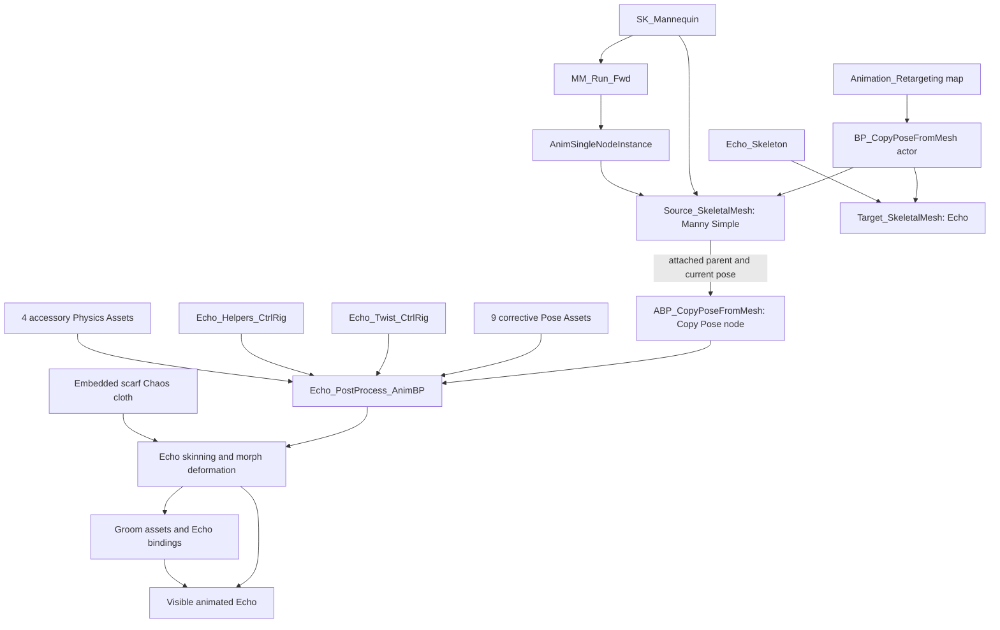

🟢 **High confidence**

# AnimationRetargeting investigation

Investigated on 29 September 2026 using the installed Unreal Editor 5.8 and its matching C++ source. Reference project: `E:\Repo\UE\Projects\AnimationRetargeting\AnimationRetargeting.uproject`. This report and extracted evidence are stored in the separate `MetaHumanTo3DCharacter\Documentation\RetargetingInvestigation` directory.

The existing demonstration and references below were inspected directly. Automation recommendations are engineering proposals supported by available APIs; no new destination, generated rig, plugin or exported animation was built during this phase.

## 1. Executive summary

**The demonstration directly opposite PlayerStart is Example 1.2, “Copy Pose From Mesh”, with Manny as the source and Echo as the destination.** Manny directly plays the looping `MM_Run_Fwd` animation. Echo's Animation Blueprint reads Manny's current pose through their component attachment and copies matching bone transforms in component space. Echo then runs its own post-process Animation Blueprint, which generates corrective morph curves, adjusts accessory bones, distributes limb twist, and simulates secondary motion. Its existing skin weights, morph targets, cloth and groom bindings produce the visible character.

This is a live runtime pose-copy demonstration. There is **no IK Rig, IK Retargeter, retarget-chain solve, retarget pose, target state machine, or generated target run sequence in this path**. The two meshes have different Skeleton assets, but share 80 bone names with matching parent relationships. The example therefore depends on a deliberately compatible body hierarchy, rather than discovering anatomy or adapting arbitrary skeletons.

The wider map does contain runtime IK retargeting examples. Their actual references and settings were also inspected to inform the future plugin. They are documented separately in [SupplementalIKConfiguration.md](SupplementalIKConfiguration.md). The most useful general-humanoid comparison is Quinn → StackOBot using `Retarget Pose From Mesh`, `RTG_Mannequin_StackOBot`, and the source/target IK Rigs. It is a neighbouring exhibit, not the PlayerStart target.

The realistic initial plugin scope is **analyse and configure retargeting for an already skinned humanoid Skeletal Mesh**. Creating a skeleton and skin weights for an unrigged mesh is a separate problem. Echo demonstrates neither automatic skeleton construction nor automatic skinning.

## 2. Exact demonstration located

Map asset: `/Game/Maps/Animation/Animation_Retargeting.Animation_Retargeting`.

The editor world had 74 actors. Its PlayerStart label is `PlayerStart2`, but the object name is `PlayerStart_1`. Object names and labels must not be treated as equivalent.

| Object/label | Position in cm | Relevant fact |
|---|---|---|
| `PlayerStart_1` / `PlayerStart2` | (2510, 10.000006, 112.000004) | Yaw −90°, forward approximately (0, −1, 0) |
| `BP_DemoDisplay_C_1` / `BP_DemoDisplay1` | (2500, −900, 0) | Sign: Copy Pose From Mesh; subtitle: Copy Animations Across Similar Skeletons |
| `BP_IKRetargeting_C_1` / `BP_CopyPoseFromMesh` | (2529.840079, −659.257392, 11.120858) | Actual class is `BP_CopyPoseFromMesh_C`; exhibit folder Example1.2 |
| `Source_SkeletalMesh` | (2354.840079, −659.257392, 11.120858) | Manny, on the left when facing the exhibit |
| `Target_SkeletalMesh` | (2654.840079, −659.257392, 11.120858) | Echo, on the right |

The PlayerStart forward line reaches the central Copy Pose display. The animation actor is only 19.84 cm off that line and approximately 669.26 cm forward. Play in Editor also visually confirmed that the spawned player faces this exhibit.

The authoritative animation actor's full world path is:

`/Game/Maps/Animation/Animation_Retargeting.Animation_Retargeting:PersistentLevel.BP_IKRetargeting_C_1`

Its misleading internal name does **not** mean it uses an IK Retargeter. Its verified class is:

`/Game/ExampleContent/AnimationRetargeting/Blueprints/BP_CopyPoseFromMesh.BP_CopyPoseFromMesh_C`

For comparison, `BP_MannequinRetargeting` is at X=3526.30 and `BP_RetargetingDifferentCharacters` is at X=4494.48. These are outside the PlayerStart's forward reference. Evidence: [scene.json](Evidence/scene.json), [AuthoritativeActor.t3d](Evidence/AuthoritativeActor.t3d).

## 3. Asset inventory

### Active body-animation assets

| Role | Full Unreal object path | Verified relationship |
|---|---|---|
| Map | `/Game/Maps/Animation/Animation_Retargeting.Animation_Retargeting` | Contains PlayerStart and the animation actor |
| Actor Blueprint | `/Game/ExampleContent/AnimationRetargeting/Blueprints/BP_CopyPoseFromMesh.BP_CopyPoseFromMesh` | Class of the selected exhibit actor |
| Source Skeletal Mesh | `/Game/Characters/Mannequins/Meshes/SKM_Manny_Simple.SKM_Manny_Simple` | Assigned to `Source_SkeletalMesh` |
| Source Skeleton | `/Game/Characters/Mannequins/Meshes/SK_Mannequin.SK_Mannequin` | Referenced by Manny mesh and run sequence |
| Source Animation Sequence | `/Game/Characters/Mannequins/Animations/Manny/MM_Run_Fwd.MM_Run_Fwd` | Directly assigned to source component's SingleAnimationPlayData |
| Destination Skeletal Mesh | `/Game/Characters/Echo/Meshes/Echo.Echo` | Assigned to `Target_SkeletalMesh` |
| Destination Skeleton | `/Game/Characters/Echo/Meshes/Echo_Skeleton.Echo_Skeleton` | Referenced by Echo mesh and both Echo Animation Blueprints |
| Main destination AnimBP | `/Game/ExampleContent/AnimationRetargeting/AnimBlueprints/ABP_CopyPoseFromMesh.ABP_CopyPoseFromMesh` | Its generated class is assigned to target component |
| Destination post-process AnimBP | `/Game/Characters/Echo/Rig/Echo_PostProcess_AnimBP.Echo_PostProcess_AnimBP` | Generated class assigned by Echo Skeletal Mesh's PostProcessAnimBlueprint property |
| Twist Control Rig | `/Game/Characters/Echo/Rig/Echo_Twist_CtrlRig.Echo_Twist_CtrlRig` | First Control Rig node in connected post-process pose path |
| Accessory helper Control Rig | `/Game/Characters/Echo/Rig/Echo_Helpers_CtrlRig.Echo_Helpers_CtrlRig` | Second Control Rig node in connected post-process pose path |

### Echo corrective Pose Assets

All nine are directly referenced by connected Pose Driver nodes. Their package and object names match:

| Full Unreal object path | Driven bone | RBF radius |
|---|---|---|
| `/Game/Characters/Echo/Rig/PoseAssets/neck_02_PoseAsset.neck_02_PoseAsset` | neck_02 | 90 |
| `/Game/Characters/Echo/Rig/PoseAssets/upperarm_l_PoseAsset.upperarm_l_PoseAsset` | upperarm_l | 50 |
| `/Game/Characters/Echo/Rig/PoseAssets/upperarm_r_PoseAsset.upperarm_r_PoseAsset` | upperarm_r | 50 |
| `/Game/Characters/Echo/Rig/PoseAssets/lowerarm_l_PoseAsset.lowerarm_l_PoseAsset` | lowerarm_l | 30 |
| `/Game/Characters/Echo/Rig/PoseAssets/lowerarm_r_PoseAsset.lowerarm_r_PoseAsset` | lowerarm_r | 30 |
| `/Game/Characters/Echo/Rig/PoseAssets/calf_l_PoseAsset.calf_l_PoseAsset` | calf_l | 40 |
| `/Game/Characters/Echo/Rig/PoseAssets/calf_r_PoseAsset.calf_r_PoseAsset` | calf_r | 40 |
| `/Game/Characters/Echo/Rig/PoseAssets/hand_l_PoseAsset.hand_l_PoseAsset` | hand_l | 50 |
| `/Game/Characters/Echo/Rig/PoseAssets/hand_r_PoseAsset.hand_r_PoseAsset` | hand_r | 50 |

Their associated `{bone}_AnimSeq` assets are included in the broad dependency inventory. They are corrective-authoring dependencies, not the locomotion sequence directly played by Echo.

### Physics, cloth and grooming

| Full Unreal path | Role |
|---|---|
| `/Game/Characters/Echo/Rig/Physics/PA_Echo.PA_Echo` | Echo mesh's general Physics Asset |
| `/Game/Characters/Echo/Rig/Physics/PA_Echo_Canister.PA_Echo_Canister` | Connected canister Rigid Body node |
| `/Game/Characters/Echo/Rig/Physics/PA_Echo_Skirt.PA_Echo_Skirt` | Connected skirt Rigid Body node |
| `/Game/Characters/Echo/Rig/Physics/PA_Echo_ShoulderPad.PA_Echo_ShoulderPad` | Connected shoulder-pad Rigid Body node |
| `/Game/Characters/Echo/Rig/Physics/PA_Echo_Pouch.PA_Echo_Pouch` | Connected pouch Rigid Body node |
| `/Game/Characters/Echo/Rig/Physics/PA_Echo_Cloth_Scarf.PA_Echo_Cloth_Scarf` | Physics Asset referenced by embedded scarf clothing asset |
| `/Game/Characters/Echo/Meshes/Echo.Echo:Echo_Cloth_Scarf` | Embedded ClothingAssetCommon with Chaos cloth configuration and physical mesh/weights |
| `/Game/Characters/Echo/Hair/Hair_S_UpdoBuns.Hair_S_UpdoBuns` | Active HairGroom asset |
| `/Game/Characters/Echo/Hair/Hair_S_UpdoBuns_Echo_M3D_LOD0_Binding.Hair_S_UpdoBuns_Echo_M3D_LOD0_Binding` | Binding to Echo's mesh |
| `/Game/Characters/Echo/Hair/Eyebrows_L_Echo.Eyebrows_L_Echo` | Active EyebrowsGroom asset |
| `/Game/Characters/Echo/Hair/Eyebrows_L_Echo_Echo_M3D_LOD0_Binding.Eyebrows_L_Echo_Echo_M3D_LOD0_Binding` | Eyebrow binding to Echo |

`/Game/Characters/Echo/Meshes/Echo_Hair.Echo_Hair` is referenced by the actor's alternative non-groom construction branch. `Echo_Hair_AnimBP` is in that asset's dependency closure. In the inspected instance, the `HairMesh` component has **no mesh or AnimBP assigned**; the groom components carry the actual hair assets.

Manny's `DefaultAnimatingRig` references `/Game/Characters/Mannequins/Rigs/CR_Mannequin_Body.CR_Mannequin_Body`, and its Physics Asset is `/Game/Characters/Mannequins/Rigs/PA_Mannequin.PA_Mannequin`. These are mesh authoring/physics associations. The source runs an `AnimSingleNodeInstance`, has no post-process AnimBP, and has no runtime Control Rig node in this exhibit. A registry reference to a Control Rig does not establish that it drives the animation.

The supplied files provide the full supporting inventory:

- [AssetInventory.csv](AssetInventory.csv): 119 inspected animation/rig/Blueprint/mesh/skeleton assets with full object paths, including the separately resolved main Copy Pose AnimBP.
- [ReferenceClosure.csv](ReferenceClosure.csv): broader registry closure, including materials, textures, physics, grooming, Pose Assets and inactive authoring dependencies.
- [dependencies.json](Evidence/dependencies.json): package dependency edges.
- [assets.json](Evidence/assets.json): loaded asset properties and export results.

The closure was seeded from all 13 exhibit Blueprint packages, then supplemented with the authoritative actor's actual component references. In particular, the main Copy Pose AnimBP was explicitly inspected even though the actor Blueprint package's registry dependency list alone did not expose that assignment. Runtime/component references take precedence over filename matching or a single registry query.

## 4. Dependency graph

The graph distinguishes supporting asset references from execution. A Skeleton supplies bone/reference-pose data; it is not itself a per-frame animation processor. No IK Rig or IK Retargeter belongs between Manny and Echo in this graph.

Component hierarchy:

    BP_CopyPoseFromMesh (Actor, not Character)
      DefaultSceneRoot
        Source_SkeletalMesh  [Manny Simple; relative X=-175]
          Target_SkeletalMesh  [Echo; relative X=300]
            HairMesh  [empty in current branch]
            HairGroom  [attached to head]
            EyebrowsGroom  [attached to head]

## 5. Runtime and complete deformation flow

### Source animation

The source component uses `ANIMATION_SINGLE_NODE`. Its direct animation is `MM_Run_Fwd`, saved playing=true, looping=true, playback rate=1, initial saved position=0. The clip is approximately 1.9 seconds at a stored target frame rate of 30 fps. It uses `SK_Mannequin`, retarget-source entry `SKM_Manny`, and has no retarget-source asset override.

Root-motion extraction is disabled. `ForceRootLock=true`, root-lock mode is Reference Pose, and normalised root-motion scale is enabled. The exhibited run is an in-place pose; the Blueprint is an Actor without a CharacterMovement component. The player pawn spawned by the level's GameMode is a separate actor and is not the source for Echo.

### Pose acquisition and copying

The target component runs `ABP_CopyPoseFromMesh_C`. Its AnimGraph has one connected pose producer:

    Copy Pose From Mesh → Output Pose

There is no state machine, sequence player, linked animation layer, IK retarget node or Control Rig in this main graph. Its EventGraph contains disabled/unconnected Update Animation and Try Get Pawn Owner nodes.

`Use Attached Parent=true` makes the node find the skeletal source through its attachment hierarchy. The explicit Source Mesh Component pin is unconnected. `Use Mesh Pose=true` copies matched **component-space** bone transforms; `Copy Curves=true` copies source animation curves. `Root Bone To Copy=None` means there is no subtree restriction. Custom attributes are not copied.

The installed `FAnimNode_CopyPoseFromMesh` implementation first initialises the destination to reference pose, builds a mapping by bone name, copies available source transforms for matched bones, and safely converts the resulting component-space pose back to local pose. Unmatched bones receive no source transform and retain their reference-pose basis until downstream procedural processing affects them. This is not a chain-length interpolation or an anatomical scale solve.

Both components use `Always Tick Pose And Refresh Bones`. Their attachment is also significant: `USceneComponent::AttachToComponent` adds the parent component as a tick prerequisite. The Blueprint does not call Set Leader Pose Component; both leader-pose properties are null. Echo therefore evaluates its own graph and post-process rather than sharing Manny's bone buffer as a leader-pose follower.

Epic's [Copy a Pose documentation](https://dev.epicgames.com/documentation/unreal-engine/copy-a-pose-in-unreal-engine) describes this attached-parent source selection and curve-copy option. The component-space behaviour above was verified in the installed 5.8 C++ implementation and asset node settings.

### Echo post-process

Echo's Skeletal Mesh assigns `Echo_PostProcess_AnimBP_C`. The component has post-processing enabled, animation enabled, and post-process LOD threshold −1. The post-process instance exists in the live runtime.

The **connected pin path**, in evaluation order, is:

    Linked Input Pose
    → Modify Curve
    → Pose Drivers: neck_02, upperarm_l, upperarm_r,
      lowerarm_l, lowerarm_r, calf_l, calf_r, hand_l, hand_r
    → Local to Component Space
    → Constraints: canister, scarf, pouch
    → Component to Local Space
    → Echo_Twist_CtrlRig
    → Echo_Helpers_CtrlRig
    → Local to Component Space
    → Rigid Bodies: canister, skirt, shoulder pad, pouch
    → Component to Local Space
    → Output Pose

The Modify Curve node uses Scale mode, alpha=1, and zero values for its named body-corrective curves. The subsequent nine Pose Drivers calculate corrective curve weights from bone rotations using Interpolative RBF with Linear function. They drive curves, not replacement locomotion poses. Echo has 181 morph targets, including body correctives and facial shapes. Of 65 unique driven curve names, 56 match existing Echo morph-target names. The other nine are the drivers' baseline pose labels and have no corresponding morph target; a pose/curve name alone does not establish vertex deformation. The exact unmatched names are recorded in report_validation.json.

The three accessory constraints operate on `R_Canister_A_Joint1_Jnt`, `C_Scarf_A_Root_Jnt`, and `R_LargePouch_A_Joint1_Jnt`. They establish accessory transforms relative to the animated torso before helper rigs and physics. Section 6 records their exact targets and weights.

`Echo_Twist_CtrlRig` extracts twist around local X from current versus initial limb rotations. It distributes it to two twist bones per upper arm, forearm, thigh and calf on both sides. The upper-arm/thigh paths invert the extracted twist; forearm/calf paths use it directly. The first twist receives weight 1, the second 0.5. Rotations are set in Local Space, initial=false, propagate-to-children=false. These existing twist bones and weights are specific to Echo's skinning design.

`Echo_Helpers_CtrlRig` uses Project Transform To New Parent, initial child/old-parent transforms and current new-parent transforms to establish accessory orientation. It drives scarf-root orientation from clavicle_l with weight 1; scarf joints 2/3 from spine_04 with weight 0.5; and left/right/centre skirt-back roots from pelvis with weight 1. The centre front-skirt root blends left/right front-root projections using quaternion Slerp at 0.5. Its rotation setters use Global Space with propagation enabled.

The four Rigid Body nodes then simulate accessory bone chains using their separate Physics Assets. This modifies accessory pose before final skeletal deformation. It is independent of source-to-destination bone matching.

Echo's final bone pose acts through its existing skin weights and reference/bind data. Corrective morph deltas alter vertices alongside skinning. The embedded scarf clothing asset contains its own physical mesh, weights, Chaos configuration and scarf collision Physics Asset. The target component allows cloth actors, has cloth simulation enabled and cloth blend weight 1. This is a further cloth-deformation system, rather than a retarget chain.

HairGroom and EyebrowsGroom attach to Echo's head and use Echo-specific groom bindings. They follow destination deformation. Their presence does not imply facial animation transfer. No component mesh deformer is assigned to Echo in the inspected instance.

### Runtime evidence

Two PIE samples were collected 0.813 seconds apart from the actual `BP_IKRetargeting_C_1` runtime actor. The source was an `AnimSingleNodeInstance`; the target was `ABP_CopyPoseFromMesh_C` with `Echo_PostProcess_AnimBP_C`.

For root, pelvis, spine_03, head, hand_l and foot_l, the source and final target component-space transform values matched in both samples to the six decimal places exported. The poses changed between samples. The lowerarm_twist_01_l translation matched while its rotation differed, consistent with Echo's downstream twist rig. This provides direct evidence of live pose copying followed by destination processing.

These are limited pose samples, not a whole-animation deformation-quality test. A playback-time getter was unavailable on the Python AnimInstance wrappers; pose changes establish animation advancement without relying on that failed getter. Evidence: [runtime.json](Evidence/runtime.json), [runtime_comparison.json](Evidence/runtime_comparison.json).

## 6. Actual retarget and procedural configuration

### Authoritative demonstration

| Setting requested | Actual configuration |
|---|---|
| Source IK Rig / target IK Rig | None in this execution path |
| IK Retargeter / chain mapping mode | None; exact bone-name mapping inside Copy Pose |
| Retarget root / pelvis scale / IK goals / solvers | Not applicable to this demonstration |
| Retarget pose / A-pose or T-pose correction | None; copies current source mesh pose |
| FK/IK overrides, speed planting, stride adjustment | None between Manny and Echo |
| Root | `root` matched by name; source animation root locked |
| Pelvis | `pelvis` matched; its component-space translation and rotation are copied |
| Spine | spine_01 through spine_05 matched, with the same immediate parent relationships |
| Neck/head | neck_01, neck_02, head matched |
| Hands/fingers | hand_l/r and three-bone thumb/index/middle/ring/pinky chains matched; no finger IK |
| Twist | Matching limb twist bones copied, then Echo twist rig recalculates rotations |
| Facial | Echo facial bones are unmatched; no facial source sequence or facial mapping |
| Extra bones | Unmatched accessory/facial bones start from reference-pose basis; specific accessory bones are then procedurally driven |

Manny Simple has 89 mesh bones, Echo 134. There are 80 name matches, 54 target-only bones and 9 source-only bones, with no immediate-parent mismatch among the shared bones. [bone_mapping.csv](Evidence/bone_mapping.csv) records every target bone and its source match. [bone_summary.json](Evidence/bone_summary.json) lists all exceptions.

The source-only bones are center_of_mass, interaction, ik_foot_root/l/r and ik_hand_root/gun/l/r. Echo's 54 extras comprise scarf, skirt, canister, pouch, shoulder-pad and facial bones. The Skeleton assets' compatible-skeleton lists are empty; the working connection comes from Copy Pose's bone mapping, not Skeleton compatibility declarations.

The reference poses are similar but **not numerically identical**. For example, Skeleton reference-pose pelvis Z is 95.89678 cm for SK_Mannequin and 93.03873 cm for Echo; upperarm_l local translation X is 17.80952 versus 14.23747 cm. These were queried from USkeleton reference poses, not measured from skin vertices. With mesh-space copying, the evaluated matched transforms follow Manny's proportions; there is no automatic preservation of Echo's original limb lengths. This explains why “similar skeletons” is a substantive requirement.

### Destination accessory constraints

All use Parent transform constraints; alpha=1 in the compiled defaults.

| Modified bone | Target bones, in order | Serialised weights |
|---|---|---|
| R_Canister_A_Joint1_Jnt | spine_02, spine_01, pelvis | 0.212, 0.283, 0.505 |
| C_Scarf_A_Root_Jnt | spine_05, clavicle_l | 0.49, 0.51 |
| R_LargePouch_A_Joint1_Jnt | spine_02, spine_01, pelvis | 1, 1, 1 |

The pouch values above are the actual stored weights; they should not be read as three percentages.

### Destination accessory simulation

All four nodes use Base Bone Space with base `root`, override world gravity (0,0,−980), and clamp linear translation limits to reference pose.

| Simulation | Linear acceleration scale XYZ | Linear velocity scale XYZ | Applied acceleration clamp XYZ |
|---|---|---|---|
| Canister | 0.4 | 0.2 | 4000 |
| Skirt | 0.4 | 0.2 | 4000 |
| Shoulder pad | 0.025 | 0.0125 | 2000 |
| Pouch | 0.4 | 0.2 | 4000 |

Full node overrides, corrective targets, curve lists and compiled defaults are in [Echo_PostProcess_AnimBP.t3d](Evidence/Echo_PostProcess_AnimBP.t3d) and its CDO export. Graph links are in [Echo_PostProcess_AnimBP.t3d.connected.json](Evidence/Echo_PostProcess_AnimBP.t3d.connected.json). Control Rig units, defaults and pin links are in [support.json](Evidence/support.json).

### Actor initialisation

The actor EventGraph is empty. Its construction graph branches on `useGroomAssets`: true configures hair and eyebrow groom assets/bindings; false sets `Echo_Hair` on HairMesh. The instantiated components confirm the groom configuration. The main pose connection is established by the component hierarchy and assigned target AnimBP, not by BeginPlay retargeter selection.

A separate `ProxyConstruct` helper contains a development-only Set Update Animation In Editor call for the source. No call to that helper is connected in the exported construction/EventGraph path. Its existence should not be described as runtime initialisation. No explicit source-mesh variable is wired into Copy Pose, and no leader-pose or explicit Blueprint tick-prerequisite setter appears in the active graph.

### Wider map: verified IK comparison

The neighbouring different-character exhibit directly plays `/Game/Characters/Mannequins/Animations/Quinn/MF_Run_Fwd.MF_Run_Fwd` on `SKM_Quinn_Simple`. Its bot target runs `/Game/ExampleContent/AnimationRetargeting/AnimBlueprints/ABP_StackOBot_Retargeting.ABP_StackOBot_Retargeting`, whose Retarget Pose From Mesh node references `/Game/ExampleContent/AnimationRetargeting/AnimBlueprints/RTG_Mannequin_StackOBot.RTG_Mannequin_StackOBot`. That retargeter selects:

- Source rig: `/Game/Characters/Mannequins/Rigs/IK_Mannequin.IK_Mannequin`.
- Target rig: `/Game/ExampleContent/AnimationRetargeting/AnimBlueprints/IK_StackOBot_Retargeting.IK_StackOBot_Retargeting`.
- Source preview: Manny Simple; actual scene source: Quinn Simple, using the same mannequin Skeleton.
- Target preview and scene mesh: `/Game/Characters/StackOBot/Mesh/SKM_Bot.SKM_Bot`, Skeleton `/Game/Characters/StackOBot/Mesh/SK_Bot.SK_Bot`.

The bot rig has 18 chains; root chain is root→root, spine is spine_01→spine_03, neck/head are single-bone chains, arms upperarm→hand, legs thigh→foot, and four fingers per hand have three-bone chains. It has no ring-finger chain. The source mannequin spine is spine_01→spine_05. Semantic chain mapping therefore supports different spine counts here. Target Neck and Head mappings are explicitly unset; all other stored mappings match chain names.

Both source and bot controller getters return pelvis as retarget root and root-motion bone. Those settings are distinct from their named Root chain. The bot solver is enabled FBIK, root pelvis, 20 iterations, no stretch, Free root behaviour, max angle 30, over-relaxation 1.3. spine_03 is excluded from solver participation. Pelvis/clavicles have rotation stiffness 0.95, feet 0.85; calf and lowerarm bones lock X/Y and prefer Z=90°.

The current 5.8 operation stack is Pelvis Motion → FK Chains → Stride Warp IK Goals → Speed Plant IK Goals → Run IK Rig → Pole Vector Alignment. Pelvis translation/rotation alphas and horizontal/vertical scales are 1; offsets and floor weight are 0. FK rotation is Interpolated, translation mode None and alphas 1 for all 18 entries. Run IK Rig enables both arm and leg chains with chain/final position/rotation alphas 1. Stride scales are neutral (forward/splay 1, sideways 0), direction comes from goals, forward axis Y.

**An enabled operation is not proof of an effective adjustment.** Bot speed-plant entries have no speed-curve names; the installed implementation looks up those names in animation curves. Bot pole-vector chain entries are all disabled even though the overall operation is enabled. These values are exposed by the expanded getters in [final_queries.json](Evidence/final_queries.json).

The retargeter's target preview offset is (150,0,0), an editor display offset rather than a locomotion/root offset. Its current Default Pose has saved local rotation offsets for pelvis, spine, arms, legs and fingers. The bot AnimBP's compiled node selects `RetargetFrom=ParentSkeletalMeshComponent` and LOD/IK thresholds −1. Its Custom Retarget Profile input is wired to a profile variable whose default chain-override list is empty. The values above describe the saved asset/default configuration; other interactive exhibits can alter profiles during execution. Exact quaternions, all chain endpoints, all six IK Rigs, all nine retargeters, mapping tables and per-operation settings are retained in [SupplementalIKConfiguration.md](SupplementalIKConfiguration.md).

The mannequin exhibit also uses runtime IK: UE4 `Jog_Fwd` → source UE4 mesh → `ABP_Mannequin_Retargeting` → `RTG_UE4Manny_UE5Manny` → Manny Simple. No evidence in these inspected target component/AnimGraph routes indicates playback of a generated target locomotion sequence. Offline batch retargeting is an available editor workflow, not the mechanism of these traced exhibits. A packaged target AnimSequence alone would also not prove its historical authoring route.

## 7. Source versus destination requirements

| Question | Copy Pose exhibit | General IK retarget route for future plugin |
|---|---|---|
| Must target already be skinned? | Yes: existing Echo mesh, weights and Skeleton | Yes for initial supported workflow; retargeting does not supply skin weights |
| Same Skeleton asset required? | No: two different Skeleton assets | No: rigs describe different skeletons |
| Bone names required? | Matching names are the actual map | Semantic chains can map different names; anatomy detection must establish them |
| Hierarchy required? | Shared humanoid parent relationships; no solve corrects a poor mapping | Valid connected chain ancestry and suitable root/pelvis/limbs |
| Different proportions? | Copied matched mesh-space transforms impose source positions | IK/FK settings can preserve/adapt target geometry, subject to contact and reach constraints |
| Different spine count? | No chain interpolation; missing/unmatched bones need handling | Yes, demonstrated by mannequin five-bone versus bot three-bone spine chains |
| Large limb length differences? | No automatic compensation | Possible with IK and pelvis/stride settings; cannot guarantee contacts outside reach |
| A-pose or T-pose? | No alignment pose in this exhibit; compatible bases assumed | Retarget pose aligns reference directions; neither named pose is universally mandatory |
| Fingers? | Shared three-bone chains copy by name | Map available finger chains; omit absent fingers and validate each hand |
| Eyes/jaw/facial? | Head copies; Echo facial bones have no source matches | Body retargeting does not establish expression or facial-rig compatibility |
| Twist bones? | Copied, then Echo-specific Control Rig redistributes twist | Analyse placement/axes/skin purpose; destination-specific correction may remain necessary |
| Extra bones? | Reference basis plus explicit Echo accessory rigs/physics | Unmapped bones are not automatically understood; add suitable destination processing |
| Cloth/hair? | Existing cloth and groom bindings follow Echo deformation | Must preserve/build destination cloth, collisions and bindings independently |

A MetaHuman-compatible body source is not the same as a compatible MetaHuman facial system. A new source mesh must be validated against the selected source IK Rig/reference pose; sharing a broadly humanoid layout is insufficient evidence of exact orientation or curve compatibility.

Epic's [IK Rig Retargeting documentation](https://dev.epicgames.com/documentation/unreal-engine/ik-rig-animation-retargeting-in-unreal-engine) supports mapping between skeletons with different bone names/counts/orientations through chains. That capability belongs to the IK workflow, not the Copy Pose node.

## 8. Manual versus reusable configuration

The final assets establish what is stored and evaluated. They do not preserve whether an author originally clicked Auto Generate, copied another asset, or manually entered every value. The following classifies ongoing responsibility and reuse, with historical authorship left unproven.

| Part | Responsibility / reuse |
|---|---|
| Skeleton, skin weights, bind pose and morph shapes | Pre-existing character authoring; per character/mesh |
| Main Copy Pose graph | Small reusable pattern for sufficiently compatible skeletons; AnimBP is currently typed to Echo Skeleton |
| Component attachment and animation assignment | Stored actor/level setup; easily recreated automatically |
| Bone-name map | Constructed automatically by runtime Copy Pose; supplies no anatomy inference |
| Source run sequence and mannequin source rig | Reusable source assets; reuse across compatible source meshes must be validated |
| Echo corrective Pose Assets and morph names | Stored destination-specific deformation authoring |
| Echo twist distribution and accessory helpers | Reusable ideas, with Echo-specific bone names, axes, weights and skin assumptions |
| Physics shapes/constraints, scarf simulation and groom bindings | Per destination character; not solved by body retargeting |
| Destination IK Rig chains/root/goals | Per skeleton; reusable across meshes with the same validated skeleton |
| Destination FBIK stiffness/preferred angles/exclusions | Per skeleton and sometimes per character/proportion; suitable defaults can be generated |
| IK chain mapping | Per source/target rig pair; stored results can be reused |
| Retarget pose and pelvis/contact adjustments | Per pair/reference pose; may require per-character refinement |
| Runtime IK AnimBP wrapper | Reusable graph/template pattern; generated class targets destination Skeleton |
| Offline retargeted sequences | Generated per destination Skeleton and source animation set; must refresh when relevant setup changes |

Automatic runtime evaluation does not imply automatic asset authoring. Most of Echo's visual polish is pre-authored destination deformation work.

## 9. Automation opportunities

The proposed `Analyze Character` result should contain a reviewable semantic bone map, ambiguity/confidence per assignment, missing requirements, reference-pose measurements and an explicitly chosen route. It should not silently treat every unknown mesh as Copy Pose compatible.

| Capability | Feasibility and required checks |
|---|---|
| Inspect destination Skeletal Mesh | Strong: enumerate reference skeleton, parent indices, reference transforms, Skeleton, LOD/skin/morph/cloth metadata |
| Detect humanoid anatomy | Strong for recognised templates; heuristic for unfamiliar skeletons. Combine names, hierarchy, bilateral geometry, bone lengths and axes |
| Identify pelvis/spine/neck/head | Trace trunk ancestry and branch points; flag multiple roots, missing pelvis, unusual spines |
| Identify arms/legs and left/right | Use ancestry plus reference-pose geometry and explicit facing/up axes; mirrored/rotated imports need validation |
| Identify hands/fingers/twist | Name/topology candidates; twist bones can be interleaved or auxiliary. Do not infer their skinning purpose from name alone |
| Create IK Rig and chains | Strong once anatomy is known; validate each start/end ancestry, non-zero length, goal and root |
| Create IK Retargeter and mapping | Strong with controllers; validate unmapped essential chains and all enabled operation entries |
| Generate retarget pose | Useful automatic first pass with auto-alignment; inspect shoulders, wrists, thumbs, knees and forward axes before acceptance |
| A-pose versus T-pose compensation | Generate local rotation offsets between validated semantic chains; avoid broad named-pose assumptions |
| Configure pelvis/root/scale | Generate baseline from reference measurements and intended root-motion policy; animation-specific validation remains necessary |
| Configure contact/planting | Generate goals and FBIK defaults; only enable curve-driven planting when appropriate named curves exist |
| Create target runtime AnimBP | Strong in editor C++; create AnimBlueprint asset and Retarget Pose From Mesh node, wire output, assign target Skeleton and retargeter |
| Generate target animation assets | Strong via batch retarget operation after setup validation; write to a new explicit output namespace |
| Reuse mannequin locomotion system | Runtime target can read the pose of a source component running the existing locomotion AnimBP. Offline alternative requires retargeting animation references/graphs and validating root motion, curves and game logic |
| Validate output | Automate missing refs/chains, compile diagnostics, pose comparisons, foot height/contact, limb reach, discontinuities, curves and LOD checks |
| Generate arbitrary skinning/facial/corrective polish | Not established by this example; separate authoring/tooling scope and validation |

A practical Build Character should separate an Editor asset-generation module from the runtime character wrapper/retarget component arrangement. Runtime should consume generated, cooked assets without depending on Editor modules.

Epic's [Auto Retargeting documentation](https://dev.epicgames.com/documentation/unreal-engine/auto-retargeting-in-unreal-engine) describes template-based automatic chains/FBIK and automatic pose alignment. It recognises common hierarchies and tolerates some variations; this is useful automation evidence, not a guarantee for arbitrary anatomy.

## 10. Unreal APIs and systems

These APIs were checked against installed 5.8 headers and/or Python introspection. Creation/mutation methods were identified but **not called**. Version-pin a future implementation to the operation-stack API rather than copying older tutorials' settings assumptions.

| Task | API/system and useful entry points |
|---|---|
| Asset discovery and references | Asset Registry: FAssetRegistryModule/IAssetRegistry; Python AssetRegistryHelpers; package dependency options; actual component/property inspection |
| Scene inspection | EditorActorSubsystem; UnrealEditorSubsystem; AActor component enumeration; USkeletalMeshComponent assignments and attachments |
| Mesh/anatomy inspection | USkeletalMesh::GetRefSkeleton(), FReferenceSkeleton bone info/parent indices/reference transforms; USkeleton reference pose; mesh LOD/render/skin-weight data |
| Create asset | IAssetTools::CreateAsset with UIKRigDefinitionFactory, UIKRetargetFactory or UAnimBlueprintFactory |
| Configure IK Rig | UIKRigController::GetController, SetSkeletalMesh, AddRetargetChain, SetRetargetRoot, SetRootMotionBone, SetBoneExcluded, solver/goal controllers |
| Built-in characterisation | UIKRigController::ApplyAutoGeneratedRetargetDefinition and ApplyAutoFBIK; native AutoGenerateRetargetDefinition/AutoGenerateFBIK return diagnostic results |
| Configure solver | IKRigFBIKController solver, bone and goal settings; preferred angles, stiffness, exclusions and root behaviour |
| Configure retarget pair | UIKRetargeterController::SetIKRig, SetPreviewMesh, AddDefaultOps, AssignIKRigToAllOps, RunOpInitialSetup |
| Map chains | AutoMapChains with Exact/Fuzzy/Clear and SetSourceChain; resulting mapping must be checked, not inferred from mode |
| Retarget pose | CreateRetargetPose, AutoAlignAllBones/AutoAlignBones, SetRotationOffsetForRetargetPoseBone; source/target selector required |
| Configure 5.8 operations | Retargeter GetOpController, typed operation controllers' GetSettings/SetSettings; PelvisMotion, FKChains, RunIKRig, StrideWarping, SpeedPlanting, AlignPoleVector and additional post operations |
| Runtime retarget node | FAnimNode_RetargetPoseFromMesh; editor UAnimGraphNode_RetargetPoseFromMesh; UIKRetargeter and FIKRetargetProcessor. UIKRetargetProcessor is a deprecated wrapper in this installed version |
| Runtime Copy Pose alternative | FAnimNode_CopyPoseFromMesh / UAnimGraphNode_CopyPoseFromMesh; attached-parent selection and curve/custom-attribute options |
| Generate AnimBP graph | FKismetEditorUtilities, FBlueprintEditorUtils, AnimGraph schema/node APIs; configure AnimBlueprint TargetSkeleton; connect root; compile and inspect diagnostics |
| Basic Blueprint scaffolding | BlueprintEditorLibrary exposes creation/compile/member/graph helpers in Python; generic AnimGraph node creation and specialised wiring may need C++ |
| Offline batch retargeting | UIKRetargetBatchOperation::RunBatchRetarget(FIKRetargetBatchOperationInputs), reflected for Blueprint/Python; DuplicateAndRetarget is deprecated in 5.8 |
| Procedural deformation | FAnimNode_PoseDriver, FAnimNode_ModifyCurve, Control Rig/RigVM, FAnimNode_Constraint, FAnimNode_RigidBody, Chaos cloth and Groom systems |
| Editor persistence/undo | FScopedTransaction, asset dirty/structural change notifications, asset registry notification, compile diagnostics and explicit output saving, when a later task authorises generation |

The reference project has no project `Source` directory or custom C++ module. Its behaviour is authored in assets and implemented by engine/plugin C++.

Authoritative local implementation locations under `D:\Epic Games\UE_5.8\Engine`:

- `Source\Runtime\AnimGraphRuntime\Private\AnimNodes\AnimNode_CopyPoseFromMesh.cpp`: attached-source discovery, name mapping, mesh-space copying, curve copying and reference-pose fallback.
- `Source\Runtime\Engine\Private\Components\SceneComponent.cpp`: parent component tick prerequisite on attachment.
- `Plugins\Animation\IKRig\Source\IKRigEditor\Public\RigEditor\IKRigController.h`: rig construction, root/chain/solver automation APIs.
- `Plugins\Animation\IKRig\Source\IKRigEditor\Public\RetargetEditor\IKRetargeterController.h`: rigs, mappings, poses and operation-stack configuration.
- `Plugins\Animation\IKRig\Source\IKRigEditor\Public\RetargetEditor\IKRetargetBatchOperation.h`: batch inputs and RunBatchRetarget.
- `Plugins\Animation\IKRig\Source\IKRig\Public\Retargeter\RetargetOps`: typed operation settings/defaults.
- `Plugins\Animation\IKRig\Source\IKRig\Private\Retargeter\RetargetOps\SpeedPlantingOp.cpp`: actual speed-curve lookup.

Epic's [Runtime IK Retargeting documentation](https://dev.epicgames.com/documentation/unreal-engine/runtime-ik-retargeting-in-unreal-engine) describes the alternative live Retarget Pose From Mesh arrangement, including keeping a hidden source refreshing its bones. A hidden source running mannequin locomotion is a suitable future extension once the source and target pair is validated.

## 11. Limitations and evidence boundaries

1. Copy Pose proves compatibility for this authored Manny/Echo pair. It does not establish automatic support for unknown proportions, hierarchy, bind axes, skin weights or extra spine bones.
2. A skeletal mesh is required by these demonstrated mechanisms. A static mesh or unskinned humanoid needs skeleton construction, skinning and deformation validation before retargeting can operate.
3. Asset configuration cannot prove historical manual versus automatic authoring. Saved mappings also cannot establish which auto-map mode originally produced them.
4. The PIE test sampled selected bones twice. It did not measure every vertex, all LODs, every animation, physics contacts or cloth/groom quality. No generic destination was tested.
5. Skeleton reference-pose measurements are not a substitute for the destination mesh's bind/skin analysis. Mesh-space copying can deform proportions even with good name coverage.
6. Facial expression transfer, eye/jaw behaviour, morph-semantic mapping and MetaHuman facial compatibility need a separate design. Echo's facial assets alone do not demonstrate facial animation.
7. Corrective morph shapes, accessory rigs, twist-axis conventions, collision shapes, cloth and groom bindings cannot reliably be manufactured from a retarget chain map.
8. Root motion is demonstrated here as a locked in-place run. A gameplay-ready character additionally needs locomotion policy, movement/capsule/camera integration, animation curves/notifies and networking decisions.
9. Runtime IK requires an evaluated source and target solve. Performance and LOD policy must be measured; the report makes no timing/throughput claim.
10. The full registry closure contains inactive/editor-authoring dependencies and neighbouring examples. Only verified component assignments and connected graph paths are treated as active execution edges.
11. The matching installed source is UE 5.8. Some old settings remain serialised alongside the current operation stack. A plugin should use supported controllers and inspect operation-specific defaults rather than editing raw serialised text.

## 12. Recommended next experiment

Use one **already skinned, body-only humanoid Skeletal Mesh** with its own Skeleton and visibly different proportions, preferably with a T-pose/reference-arm direction that differs from Manny. Perform the experiment in a separate test project or new authorised content namespace. Keep this reference project untouched.

1. Establish a short anatomy manifest: root, pelvis, spine, neck/head, clavicles, arms/hands, legs/feet, fingers and twist candidates; capture reference transforms, facing/up axes and unresolved assignments.
2. Evaluate Copy Pose compatibility as an analysis result. Do not choose it merely because many bone names match. Use IK for the deliberate proportion/reference-pose differences in this test.
3. Reuse the verified mannequin source IK Rig. Create the destination IK Rig with explicit semantic chains and pelvis/root policy. Try built-in auto-characterisation/FBIK first; record results, corrections and ambiguity.
4. Create one IK Retargeter, inspect every essential mapping, auto-align the target pose, and correct only visible failures. Start with pelvis/FK/IK. Enable planting only when valid source speed curves and a contact test justify it.
5. Build a two-component actor: source Manny Simple directly playing MM_Run_Fwd, target attached to source with a target-Skeleton AnimBP containing Retarget Pose From Mesh → Output Pose. Keep destination body post-processing only if required by its authoring. Exclude accessory simulation from this first acceptance test.
6. Compare one full run loop and a basic idle/arm test: no missing bones, stable orientation, no knee/elbow inversion, acceptable shoulders/hands, target limb-length preservation, measured foot-ground error, and clean compile/runtime diagnostics. State acceptable tolerances before judging success.
7. Export that same run through RunBatchRetarget into a new output folder. Play it directly on a second target instance and compare against runtime IK at aligned sample times, including root motion and required curves.

This small test separates skeleton analysis, pair configuration and animation consumption. Record which corrections were required before deciding the automation design. A successful body retarget result is the entry condition for a later experiment in which Manny's actual locomotion AnimBP drives the source and the destination follows it at runtime. It is not yet a full Build Character acceptance test.

### Reproduce the exact Manny → Echo exhibit in a clean project

This is a recipe for later authorised work, not actions performed during the investigation.

1. Make the relevant engine systems available: skeletal animation/AnimGraph nodes, Control Rig, Chaos cloth and Groom. Migrate Manny Simple, MM_Run_Fwd, Echo, both destination AnimBPs, Echo Control Rigs and their complete referenced dependencies using Unreal asset migration; retain Skeleton, Pose Assets, Physics Assets, morph data, cloth and groom bindings. Do not copy only similarly named files.
2. Create an Actor with a Scene root, Manny source component and Echo target component attached under the source. Use source relative X=−175 and target relative X=300 for the same side-by-side display; these offsets are presentation, not body-retarget settings.
3. Set Manny's animation mode to Use Animation Asset and assign MM_Run_Fwd, playing/looping=true, rate=1. Set Echo's mode to Use Animation Blueprint and assign ABP_CopyPoseFromMesh_C, typed to Echo_Skeleton.
4. Rebuild the target graph if required: Copy Pose From Mesh → Output Pose; Use Attached Parent=true, Use Mesh Pose=true, Copy Curves=true, Root Bone To Copy=None, Copy Custom Attributes=false. Leave the explicit source pin unwired. Maintain parent-before-child evaluation and Always Tick Pose And Refresh Bones on the source.
5. Preserve Echo mesh's Echo_PostProcess_AnimBP assignment and enable it on the component. To reproduce final visual deformation, retain the exact connected corrective/constraint/twist/helper/physics graph and supporting character assets described above. A main Copy Pose graph alone reproduces motion transfer but omits Echo's authored deformation polish.
6. Attach the hair/eyebrow groom components to Echo's head and assign their verified assets and Echo bindings. Leave HairMesh empty for the current groom branch. Preserve the embedded scarf clothing configuration.
7. Run and confirm live source pose advancement, matching body transforms and downstream twist/accessory processing. No IK Rig or target-generated run sequence is needed to reproduce this exhibit.

## Evidence index and verification

| Evidence | What it establishes |
|---|---|
| scene.json, AuthoritativeActor.t3d | Map, positions, labels/classes, component refs, attachment and direct source animation |
| assets.json, inventory.json, dependencies.json | Loaded asset refs/properties and broader package closure |
| ABP_CopyPoseFromMesh.t3d and CDO | Actual Copy Pose graph, target Skeleton and compiled node settings |
| detail.json | Actual component bone hierarchies, instances, cloth/post-process settings and node defaults |
| bone_mapping.csv, bone_summary.json | 80 shared mesh bones; all unmapped bones and parent comparison |
| Echo_PostProcess_AnimBP.t3d, CDO, connected.json | Exact downstream pose path, corrective drivers, constraints, physics and rig classes |
| support.json | Actual rig/retargeter controller values and Control Rig units/pin links |
| final_queries.json | Root-motion clip settings, both Skeleton reference poses, expanded IK per-chain defaults and final dirty-package state |
| runtime.json, runtime_comparison.json | Live source/target instances, two advancing poses, matching body transforms and differing twist rotation |
| SupplementalIKConfiguration.md | Separate scene assignments, six rigs, nine retargeters, endpoints/mappings/settings/poses |
| baseline.json, preservation.json | Hash/length/timestamp preservation and file-set comparison |
| report_validation.json | Deliverable coverage, local links, verified full asset paths, graph/settings checks, morph-name matches, runtime comparisons and preservation checks |

The exports are evidence snapshots, not replacement assets or an import format for rebuilding the project. Where a basename occurs more than once in different folders, resolve it through the full path in assets.json; for the authoritative Skeletons use the explicit `Skeleton_Meshes_SK_Mannequin.t3d` and `Skeleton_Meshes_Echo_Skeleton.t3d` exports.

Final checks: all 673 files under Content and Config plus the project descriptor have unchanged SHA-256, length and modification timestamps; no additions/deletions in that scope. Final dirty map/content package lists are empty, PIE is stopped, and the editor shows All Saved. Editor logs, transient PIE worlds and caches naturally change during use and are outside that preservation comparison. No reference content/settings were saved, regenerated, renamed or deleted, and no Git stage/commit/push operation was performed.

Level 1 self-review checked scene geometry against the selected class, connected AnimGraph pin order, actual source/target component assignments, Skeleton/mesh distinction, active-versus-authoring refs, inherited operation defaults, runtime/offline classification, reproduction instructions and preservation evidence. The twelve requested deliverable areas are covered; proposed automation remains explicitly untested.
